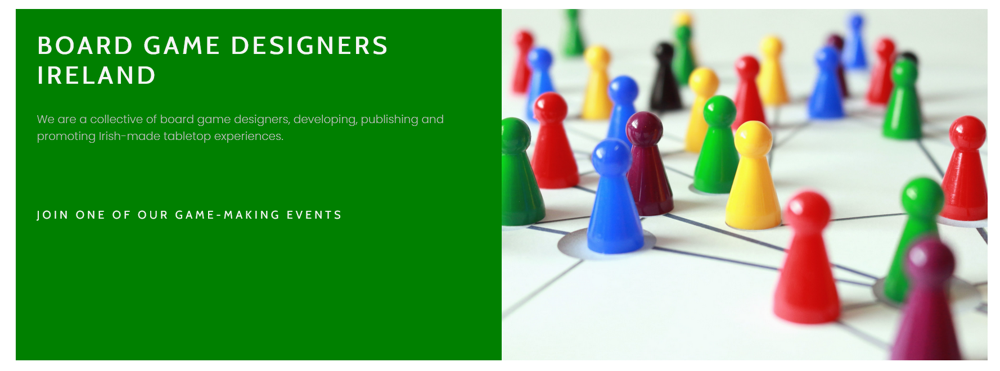
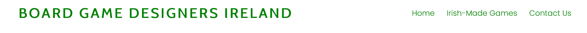
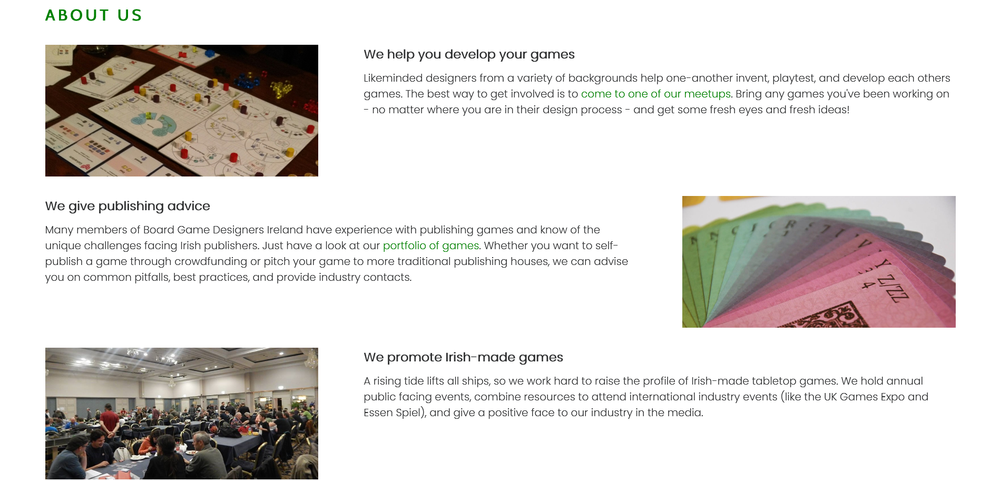
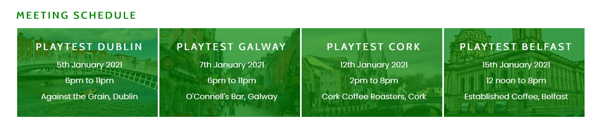
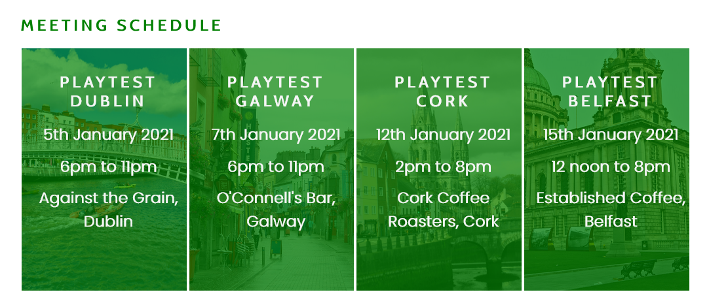
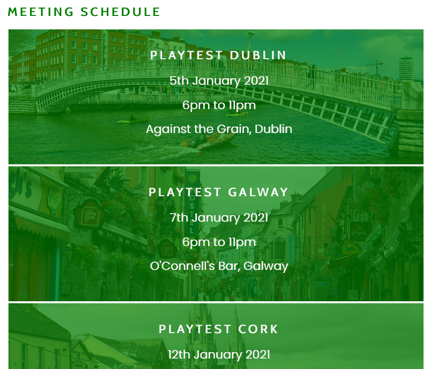
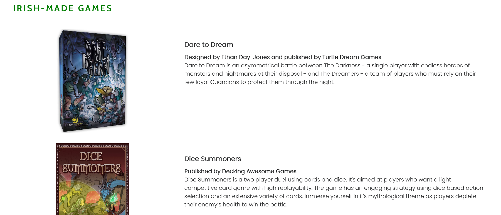
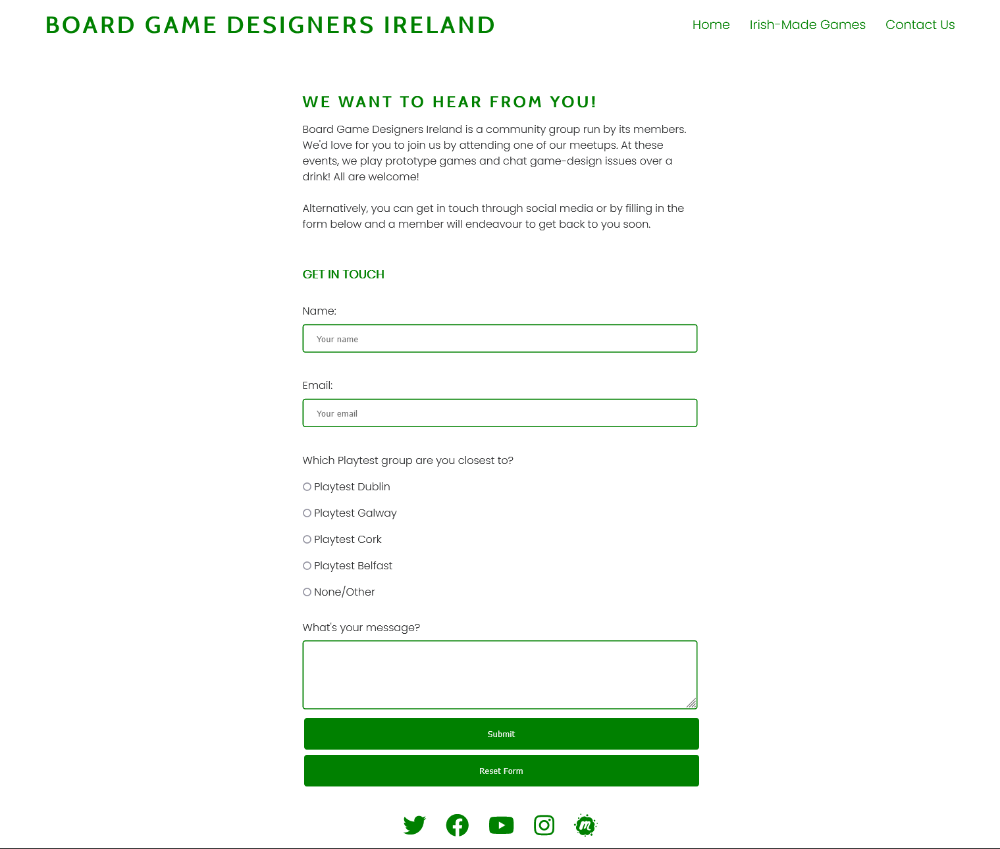

# README for Board Game Designers Ireland HTML/CSS Project

## Introduction

This is an informational website for board game designers who live in Ireland. It is to inform them about the services provided by the Board Game Designers Ireland co-operative group and to give them different ways of getting in contact. It is a professional-facing website, not typically of interest to the general public.

[Board Game Designers Ireland Website](https://robindavidgames.github.io/ci-project01/index.html)

Screenshot from ami.responsivedesign.is

## Features

### Title

* The title section gives a brief outline of Board Game Designer Ireland's purpose and immiedately offers a way for somebody interested to get in touch (by attending a meet up). It provides an internal link to the meetup details. To the right, it has an eye catching image with a subtle zoom animation. On a smaller screen, the text section moves above the main image.

* This is valuable to the user because it makes the website purpose clear.

### Navigation Bar

* This links to other pages on the website. On all pages it is in the top-right corner.

* This is valuable to the user because it allows them to clearly see available pages to navigate them with a single click.

* Outside of the main page, the title and navigation bar sit side-by-side. On smaller screens, they stack on top of each other.

### About Us

* The About Us section further clarifies the activites carried out by the co-op and their wider ambitions. It uses a staggered layout and images to convey the information in a more interesting way. On a smaller screen, the images and text sections are stacked.

* This is valuable to the user because it concisely delivers information about Board Game Designers Ireland and conveys the purpose and benefits of the group.

### Meet Up

* This section gives information about the different regional groups that belong to Board Games Designers Ireland. They have background images with a semi-transparent colour overlay to tie in to the project's colour theme. On smaller screens these divs increase in height to accomodate the text. On very small screens, the divs increase in width to 100% and then stack.

* This is valuable to the user because it gives them an easy way to become involved. It is the primary call to action on the website.

### Games

* The Games page presents a portfolio of games made by the co-operative. On smaller screens, the images and text stack.

* This is valuable to the user because it develops confidence in the Board Game Designers Ireland group.

### Contact

* The Contact page provides a form that the visitor can use to send a message to the co-operative. It uses a working form which includes validation and required fields. It has buttons styled to match the wider website. On smaller screens, it reduces in width to remain attractive.

* This is valuable to the user because it allows them to get in contact without other social media links or clicking through to an email account.

### Footer

* Social media links sit in the footer of every page and provide the visitor another way of getting in touch. All of these links open in external tabs. They are created with Font Awesome glyphs.

* This is valuable to the user because it allows them to follow accounts or get in touch through a platform of their choice.

## Testing

1. The site functions as expected. 
2. All internal and external links work.
3. The design is responsive to screen size.
4. The contact us form is working. The form validates input.

## Bugs and Issues

### Fixed Bugs and Issues

1. Font awesome does not provide alt text for asssitive readers. The Social Media links have a function that requires alt text, but are presented as font awesome font glyphs. The alt text that I had initially provided wasn't working correctly for these. I had to ask on Slack for some guidance on this and was pointed to font awesome documentation that allowed me to establish aria-labels for the icons.
2. The call to action link was created with a h3 tag (following from a h1 tag for the page title). However, I read that using header tags out of order causes problems for some assistive readers. As such, I instead styled it with a unique ID. For the same reason, I also used CSS to create all upper-case titles, rather than writing them in upper case.
3. Text in the Meetup section needed greater contrast than other headings used in the page. I created a CSS rule for ".location h2" to override their styling.
4. Text in the Meetup section was getting squashed on smaller resolution screens and eventually leaving the boudaries of the respective div. To solve this, I created a media query for screens 750px wide and created style rules to increase the width of the divs, to stack them, and to adjust the background images in each div.
5. When checking accessibilty using Lighthouse, I discovered that I had mistyped meta data "viewport" as "viewpoint", rendering it useless to Chrome. This fixed a lot of bugs when I tried testing the website on Chrome, though these were not visible on Firefox, which is why the typo was missed for so long. 
6. When testing on my own computer, images in the meetup section were displaying correctly, but not when viewed on other computers. The image links were incorrect but being displayed because they were in my browser cache. I corrected the links to show relative paths.
7. On very narrow screens (less than 500pixels) elements on the game page became misaligned. Additionally, images in the About Us section shrank to very small sizes, becoming unreadable. To correct this, I added an additional media query to stack elements and limit the width of images.
8. On very small screens, the navigation links stacked, which would be fine, but they did so in a non-ideal order. To solve this, I added a media query to reduce the font size and padding, keeping the navigation links on the same line.

### Outstanding Issues

None.

## Validator Testing
    
1. HTML
The website passed the HTML validator without issue. [Link](https://validator.w3.org/nu/?doc=https%3A%2F%2Frobindavidgames.github.io%2Fci-project01%2Findex.html)

2. CSS
The website passed the CSS validator without issue. [Link](https://jigsaw.w3.org/css-validator/validator?uri=https%3A%2F%2Frobindavidgames.github.io%2Fci-project01%2Findex.html&profile=css3svg&usermedium=all&warning=1&vextwarning=&lang=en)

3. Accessibility using Lighthouse
The website did very well on the Lighthouse accessbility test on both desktop and mobile.

## Deployment
This site was deployed to GitHub Pages. [The live link is here.](https://robindavidgames.github.io/ci-project01/index.html)

## Credits
### Content
1. Code for putting a transparent colour over a backing image was adapted from https://css-tricks.com/tinted-images-multiple-backgrounds/
2. The basics for laying out the navigation bar and meetup divs were adapted from the Love Running Project.
3. The code for animating the main image in index was adapted from the Love Running Project.
4. Some of the CSS style rules for the contact form were adapted from https://www.w3schools.com/css/css_form.asp

### Media
All the following images have a creative commons licence:
1. Cover image: [pixnio](https://pixnio.com/objects/toys/figure-game-plastic-board-path)
2. Dublin image: [staticfilter](https://live.staticflickr.com/828/40129539220_6ab2c80255_b.jpg)
3. Galway image: [staticfilter](https://live.staticflickr.com/6063/6107383917_7fa8c447cc_b.jpg)
4. Cork image: [wikimedia](https://upload.wikimedia.org/wikipedia/commons/4/49/Ballintemple%2C_Cork%2C_Ireland_-_panoramio_%281%29.jpg)
5. Belfast image: [wikimedia](https://commons.wikimedia.org/wiki/File:Belfast_City_Hall.jpg)

All the images from the About Us section are my own.

All the images and game descriptions on the Games page are promotional material:
1. Text and image for Dare to Dream: [BoardGameGeek](https://boardgamegeek.com/boardgame/232950/dare-dream)
2. Text and image for Dice Summoners: [BoardGameGeek](https://boardgamegeek.com/boardgame/252544/dice-summoners)
3. Text and image for Exquisite Beast: [BoardGameGeek](https://boardgamegeek.com/boardgame/205976/exquisite-beast)
4. Text and image for Judean Hammer: [BoardGameGeek](https://boardgamegeek.com/boardgame/326998/judean-hammer)
5. Text and image for Kingdom's Candy: Monsters: [BoardGameGeek](https://boardgamegeek.com/boardgame/276281/kingdoms-candy-monsters)
6. Text and image for Letterpress: [BoardGameGeek](https://boardgamegeek.com/boardgame/294294/letterpress)
7. Text and image for Luzon Rails: [BoardGameGeek](https://boardgamegeek.com/boardgame/313090/luzon-rails)
8. Text and image for Tag City: [BoardGameGeek](https://boardgamegeek.com/boardgame/257667/tag-city)
9. Text and image for Trepanation: [BoardGameGeek](https://boardgamegeek.com/boardgame/270265/trepanation)